## MediaWiki

### Requirements
* Docker
* Docker Compose

## install 
* disable docker-compose.yml LocalSettings.php
  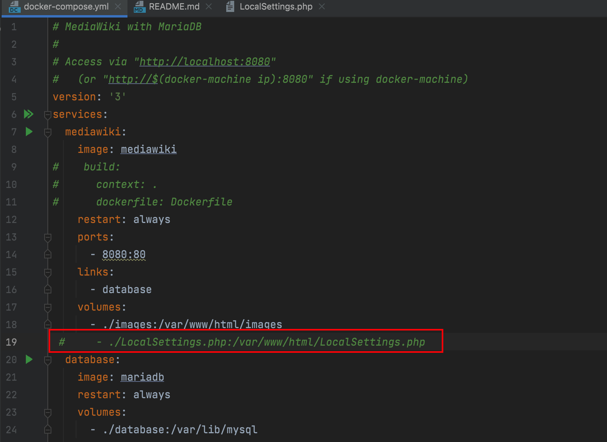
  
* docker-compose up
  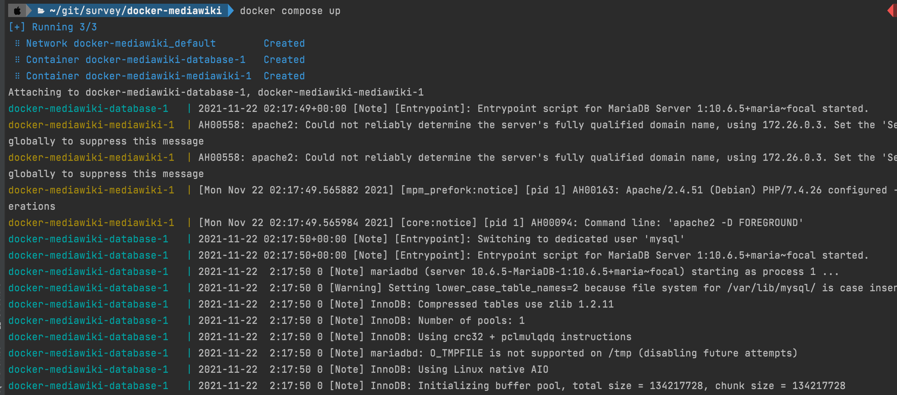
  
* open browser localhost:8080 
  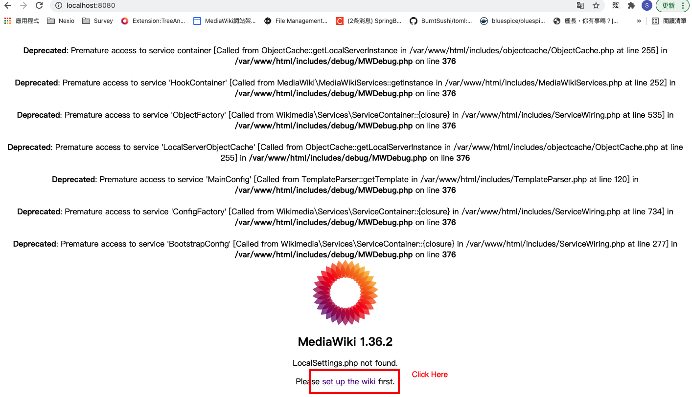
	1. intall
	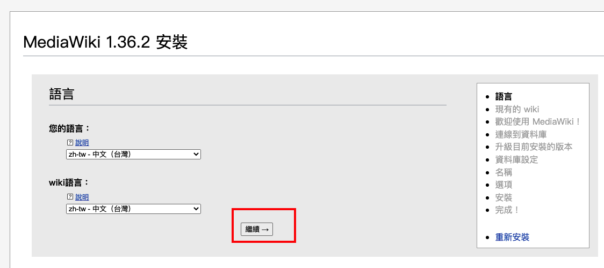
	2. doc
	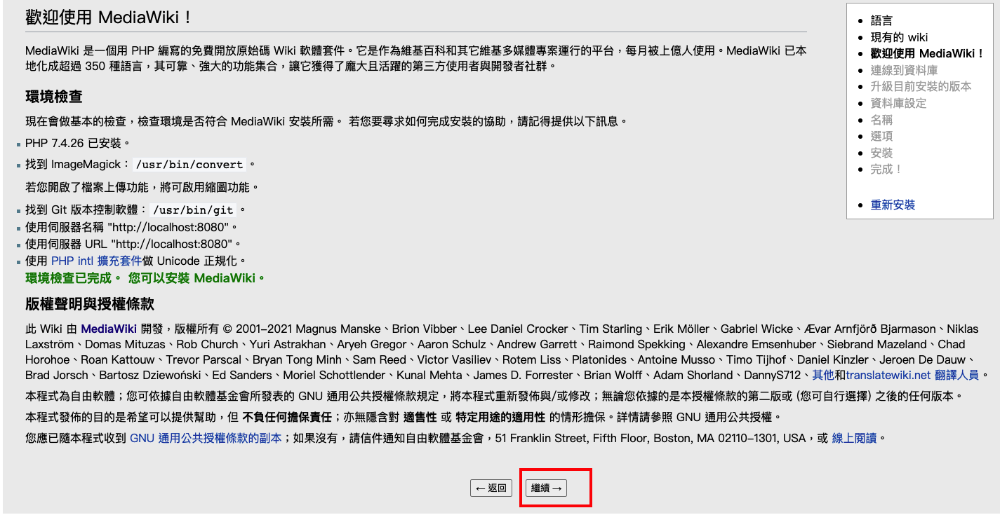
	
	3. database settings (info from dokcer-compose.yml)
	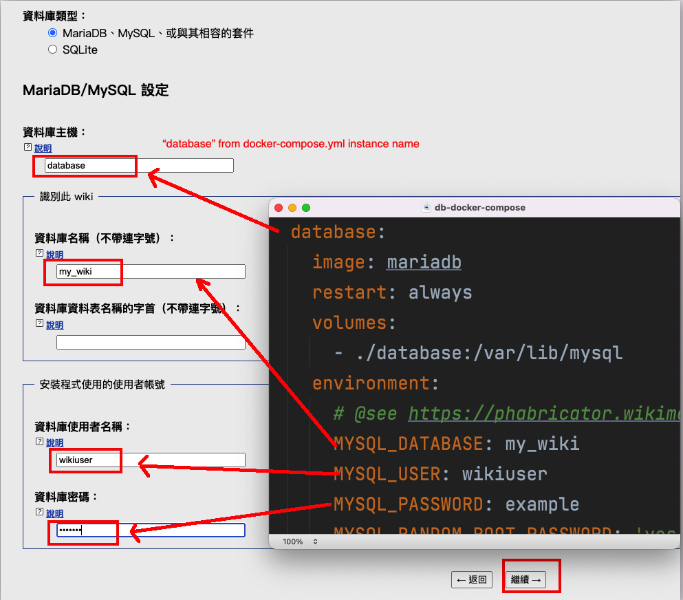
	
	4. Database install
	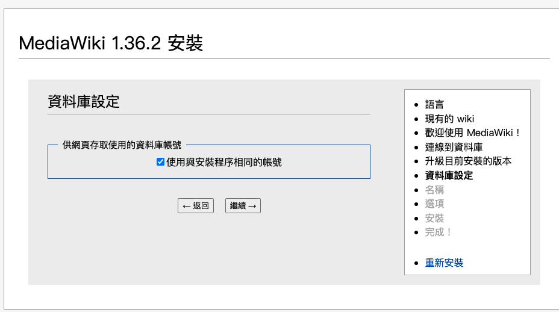
	
	5. Database install Info
	
	
	6. Project naming
	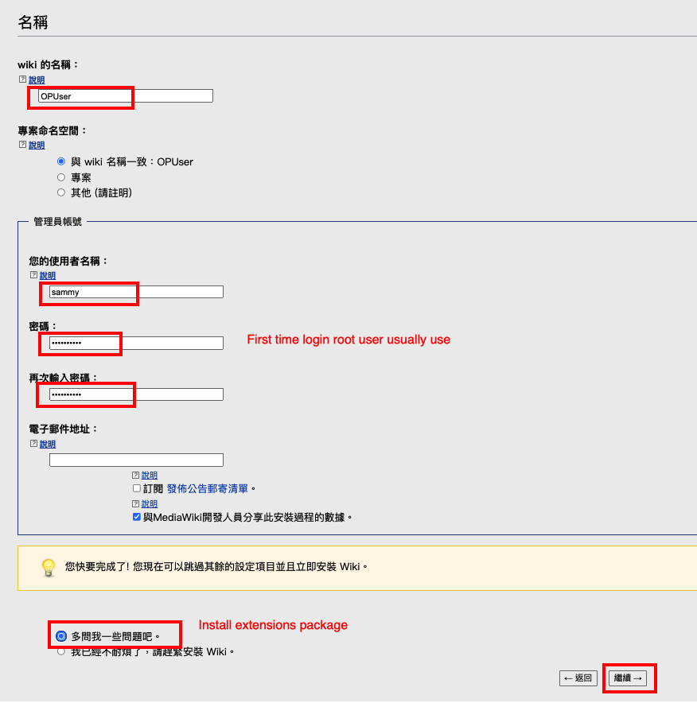
	
	7. click checkbox for enable extensions
	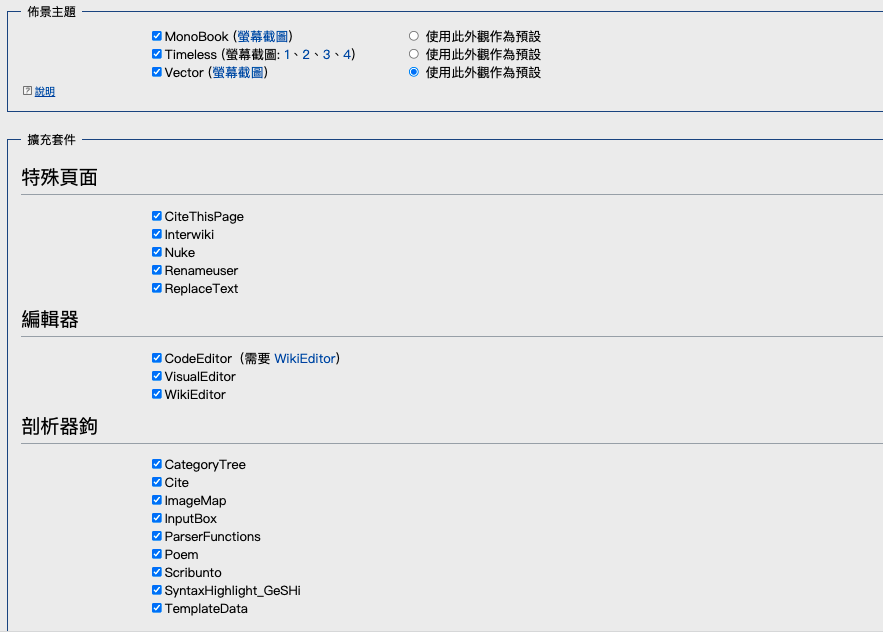
	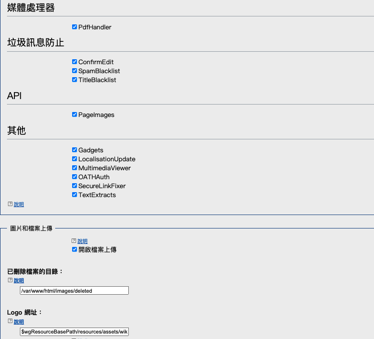
	
	8. install wiki
	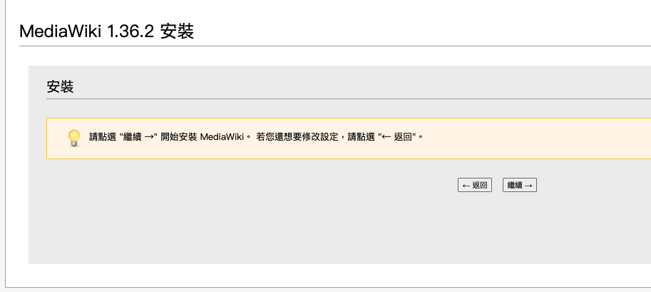
	
	9. install wiki process
	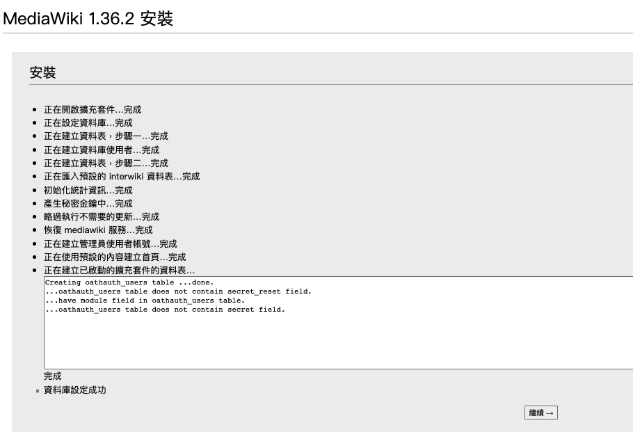
	
	10. dowanload LocalSettings.php
	download LocalSettings.php and move to work directory
	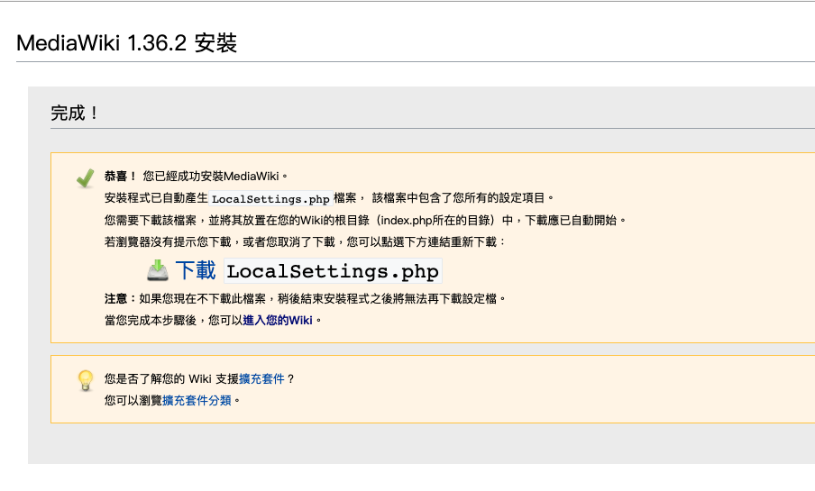
	
	11. replace LocalSetting $wgServer with ip or domain 
			
		 The protocol and server name to use in fully-qualified URLs
		
		$wgServer = "http://192.168.0.160:8080";
	
	12. Add Parsolid setting below LocalSettings.php
		
			# End of automatically generated settings.
			# Add more configuration options below.
			
			$PARSOID_INSTALL_DIR = 'vendor/wikimedia/parsoid'; 
			
			# bundled copy
			// For developers: ensure Parsoid is executed from $PARSOID_INSTALL_DIR,
			// (not the version included in mediawiki-core by default)
			// Must occur *before* wfLoadExtension()
			if ( $PARSOID_INSTALL_DIR !== 'vendor/wikimedia/parsoid' ) {
				   AutoLoader::$psr4Namespaces += [
				   		// Keep this in sync with the "autoload" clause in
				   		// $PARSOID_INSTALL_DIR/composer.json
				      'Wikimedia\\Parsoid\\' => "$PARSOID_INSTALL_DIR/src",
				    ];
			}
				
			wfLoadExtension( 'Parsoid', "$PARSOID_INSTALL_DIR/extension.json" );
				
			# Manually configure Parsoid
			$wgVisualEditorParsoidAutoConfig = false;
			$wgParsoidSettings = [
				  'useSelser' => true,
				  'rtTestMode' => false,
				  'linting' => false,
			];
			$wgVirtualRestConfig['modules']['parsoid'] = [
				// URL to the Parsoid instance.
				// If Parsoid is not running locally, you should change 				$wgServer to match the non-local host
				// While using Docker in macOS, you may need to replace $wgServer with http://host.docker.internal:8080
				'url' => $wgServer . $wgScriptPath . '/rest.php',
				// Parsoid "domain", see below (optional, rarely needed)
				// 'domain' => 'localhost',
			];

	13. enable docker-compose.yml LocalSettings.php
  

	14. restart docker compose

###  Edit [SideBarMenu](https://www.mediawiki.org/wiki/Extension:SideBarMenu)
  Keyin "mediawiki:sidebar" in search box
  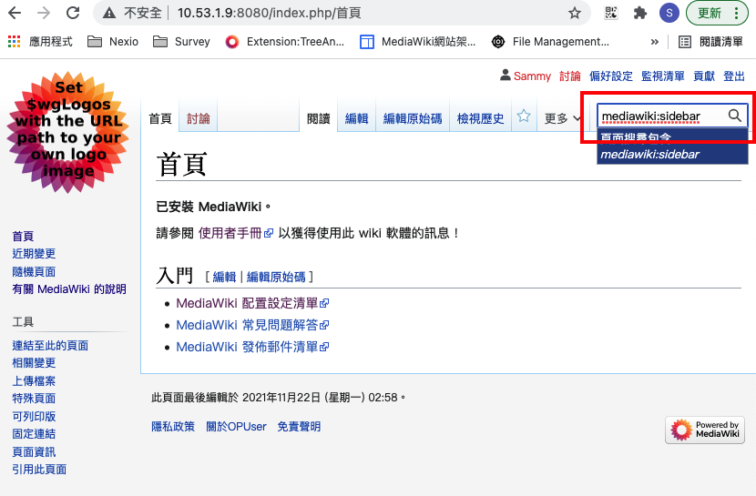
  
  Edit SideBar Page
  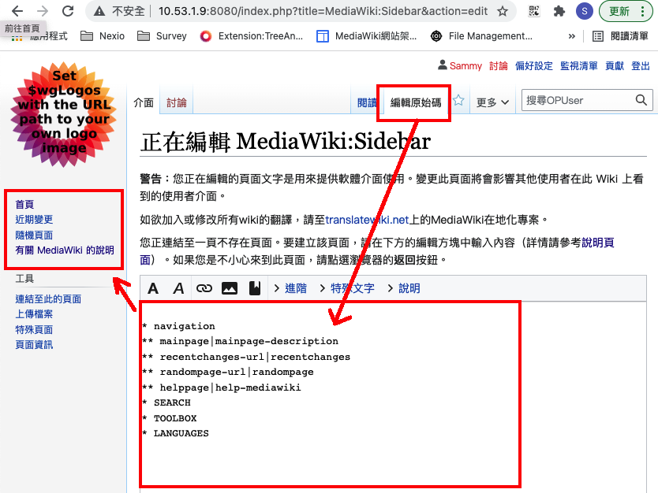
  
  Sidebar sample copy and paste into Textarea
  
  	* 工作事項
	** SOP|SOP
	** 會議|會議
	** 年度工作計劃|年度工作計劃
	* SOP
	** WIKI|MainPage
	** TASK|工作
	* Weekly Jobs
	** Maintance|維護
	** Monitor|監控
	*公司規範
	**leave|請假
	**education|教育訓練

###  Edit [TreeAndMenu](https://www.mediawiki.org/wiki/Extension:TreeAndMenu)

  Keyin "mediawiki:toolbox" in search box
  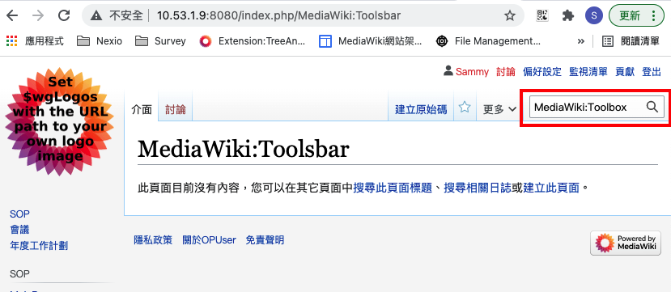
  
   Edit Toolbox Page
  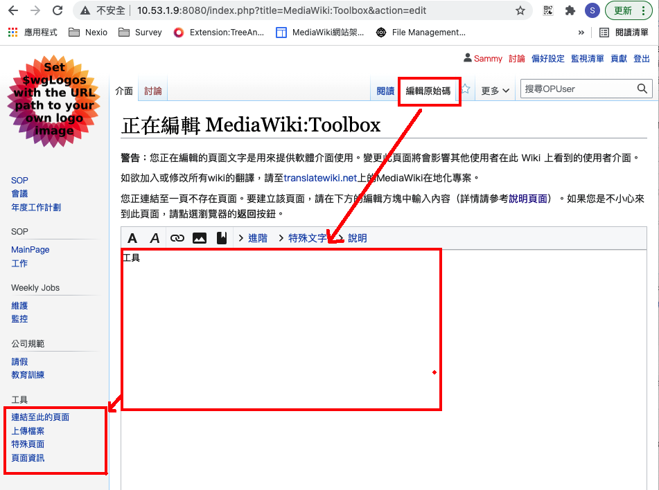
  

